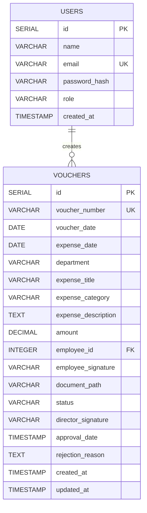

# Expense Voucher Management System

A role-based expense voucher management system built with React, Node.js, Express, PostgreSQL, JWT, bcrypt, and Multer.

**Workflow:** Employee → Create/Draft → Submit → Director Review → Approve/Reject → Accounts Review

## 1. Project Setup Instructions

### Prerequisites
- Node.js 22+
- npm
- PostgreSQL
- Git

### Clone
```bash
git clone <repository-url>
cd expense-voucher-system
```

### Database
Create the database:
```sql
CREATE DATABASE expense_voucher_db;
```

Run the schema:
```bash
psql -U <postgres-user> -d expense_voucher_db -f database/schema.sql
```

### Backend
```bash
cd backend
npm install
cp .env.example .env
mkdir -p uploads
node server.js
```

Backend API:
```text
http://localhost:5001
```

Health check:
```text
GET http://localhost:5001/api/health
```

### Frontend
In another terminal:
```bash
cd frontend
npm install
npm run dev
```

Vite normally runs at:
```text
http://localhost:5173
```

### Test users
Signup is intentionally not implemented. Users are created/seeded directly in the database.

Development credentials:
```text
Employee: employee@test.com / password123
Director: director@test.com / password123
Accounts: accounts@test.com / password123
```

These credentials are for development/testing only.

---

## 2. Database Schema Explanation

The database has two main tables:

- `users` — application users and roles.
- `vouchers` — expense voucher data and workflow state.

### Entity Relationship Diagram



### `users`

| Column | Description |
|---|---|
| `id` | Unique user identifier |
| `name` | Display name |
| `email` | Unique login email |
| `password_hash` | bcrypt-hashed password |
| `role` | `EMPLOYEE`, `DIRECTOR`, or `ACCOUNTS` |
| `created_at` | Account creation timestamp |

### `vouchers`

| Column | Description |
|---|---|
| `id` | Unique voucher identifier |
| `voucher_number` | Unique auto-generated voucher number |
| `voucher_date` | Voucher date |
| `expense_date` | Expense occurrence date |
| `department` | Employee department |
| `expense_title` | Expense title |
| `expense_category` | Expense category |
| `expense_description` | Expense details |
| `amount` | Expense amount |
| `employee_id` | Foreign key to `users.id` |
| `employee_signature` | Employee signature/file reference |
| `document_path` | Uploaded supporting document reference |
| `status` | Voucher workflow status |
| `director_signature` | Uploaded director signature reference |
| `approval_date` | Approval timestamp |
| `rejection_reason` | Reason for rejection |
| `created_at` | Creation timestamp |
| `updated_at` | Last update timestamp |

### Relationship

One user can create multiple vouchers:

```text
USERS (1) ──────────── (many) VOUCHERS
```

`vouchers.employee_id` references `users.id`.

### Voucher state flow

```text
DRAFT
  │
  │ Employee submits
  ▼
SUBMITTED
  │
  ├──────── Director approves ───────► APPROVED
  │
  └──────── Director rejects ────────► REJECTED
```

Only draft vouchers can be edited or deleted by the employee. Only submitted vouchers can be approved or rejected.

---

## 3. API Documentation

Base URL:
```text
http://localhost:5001/api
```

Protected endpoints require:
```http
Authorization: Bearer <JWT_TOKEN>
```

### Authentication

#### POST `/auth/login`
Logs a user in and returns a JWT.

Request:
```json
{
  "email": "employee@test.com",
  "password": "password123"
}
```

Response:
```json
{
  "message": "Login successful",
  "token": "<jwt-token>",
  "user": {
    "id": 3,
    "name": "Employee",
    "email": "employee@test.com",
    "role": "EMPLOYEE"
  }
}
```

---

### Vouchers

#### POST `/vouchers`
**Role:** EMPLOYEE

Creates a voucher.

**Content-Type:** `multipart/form-data`

Fields:
```text
voucherDate
expenseDate
department
expenseTitle
expenseCategory
expenseDescription
amount
employeeSignature
document
```

The backend generates the voucher number and associates the voucher with the authenticated employee.

#### GET `/vouchers/my`
**Role:** EMPLOYEE

Returns vouchers belonging to the logged-in employee.

#### GET `/vouchers/:id`
**Roles:** authenticated users

Returns one voucher. Employees can only access their own vouchers.

#### PUT `/vouchers/:id`
**Role:** EMPLOYEE

Updates a draft voucher owned by the employee.

#### DELETE `/vouchers/:id`
**Role:** EMPLOYEE

Deletes a draft voucher owned by the employee.

#### POST `/vouchers/:id/submit`
**Role:** EMPLOYEE

Submits a draft voucher for director review.

#### GET `/vouchers/pending`
**Role:** DIRECTOR

Returns vouchers with `SUBMITTED` status.

#### GET `/vouchers`
**Roles:** DIRECTOR, ACCOUNTS

Returns all vouchers.

#### POST `/vouchers/:id/approve`
**Role:** DIRECTOR

Approves a submitted voucher.

**Content-Type:** `multipart/form-data`

Field:
```text
directorSignature
```

The uploaded signature is stored as a file reference and the voucher becomes `APPROVED`.

#### POST `/vouchers/:id/reject`
**Role:** DIRECTOR

Rejects a submitted voucher.

Request:
```json
{
  "rejectionReason": "Receipt is missing."
}
```

A rejection reason is mandatory.

### Authorization matrix

| Action | Employee | Director | Accounts |
|---|---:|---:|---:|
| Login | Yes | Yes | Yes |
| Create voucher | Yes | No | No |
| View own vouchers | Yes | — | — |
| View all vouchers | No | Yes | Yes |
| Edit draft | Yes | No | No |
| Delete draft | Yes | No | No |
| Submit voucher | Yes | No | No |
| Approve | No | Yes | No |
| Reject | No | Yes | No |
| Upload director signature | No | Yes | No |
| Modify vouchers | Own drafts | Approval only | No |

---

## 4. Assumptions Made During Development

1. **Public signup is not required.** User accounts are assumed to be provisioned by an administrator or seeded directly in the database.
2. The supported roles are `EMPLOYEE`, `DIRECTOR`, and `ACCOUNTS`.
3. Passwords are stored using bcrypt hashing.
4. Vouchers start as `DRAFT`.
5. Employees can edit/delete only their own draft vouchers.
6. Submitted vouchers are read-only for employees.
7. Only directors can approve/reject submitted vouchers.
8. A rejection requires a rejection reason.
9. An approval requires a director signature image.
10. Accounts has read-only access and does not modify voucher data.
11. Files are stored locally in `backend/uploads/` for this assessment; AWS S3 is not required for the current submission.
12. Signature images are expected to be JPG/JPEG or PNG through the UI.
13. Uploaded file references are stored in PostgreSQL rather than binary file contents.
14. Supporting documents are served by the backend for viewing.
15. Voucher numbers are generated automatically by the backend and stored as unique values.
16. Currency is displayed as Indian Rupees (`₹`).
17. Reimbursement/payment execution is outside the scope; Accounts currently provides visibility into voucher information.
18. Advanced audit history/versioning is outside the scope of this assessment.

---

## 5. Database Schema / Migration

The complete PostgreSQL schema is provided in:

```text
database/schema.sql
```

Apply it with:
```bash
psql -U <postgres-user> -d expense_voucher_db -f database/schema.sql
```

---

## 6. Environment Variables

Copy the example:
```bash
cp backend/.env.example backend/.env
```

The current backend requires:

```env
JWT_SECRET=replace_with_a_secure_secret
```

Do not commit `.env`.

---

## 7. Screenshots

Screenshots are best kept in a small document inside the repository rather than sent as many individual email attachments.

Recommended file:
```text
docs/SCREENSHOTS.md
```

Recommended screenshots:
1. Employee Dashboard
2. Create Voucher
3. Employee Voucher Details
4. Director Pending Approvals
5. Director Approval + Signature Upload + Director Rejection
6. Accounts All Vouchers
7. Accounts Voucher Details with uploaded document/signature

For the submission email, provide the GitHub repository link and mention that the documentation/screenshots are included in the repository. Only attach screenshots directly if the evaluator specifically requests attachments.

---

## Tech Stack

**Frontend:** React, Vite, React Router, Axios, CSS

**Backend:** Node.js, Express, JWT, bcrypt, Multer, CORS

**Database:** PostgreSQL

**File storage:** Local filesystem for the assessment

## Production Build

```bash
cd frontend
npm run build
```

Preview:
```bash
npm run preview
```
