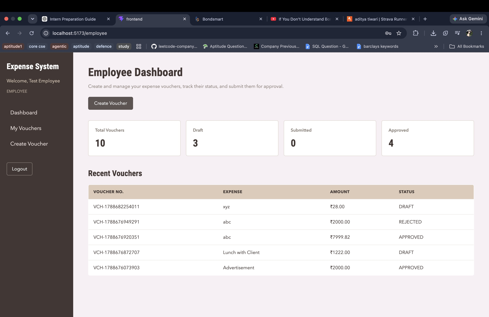
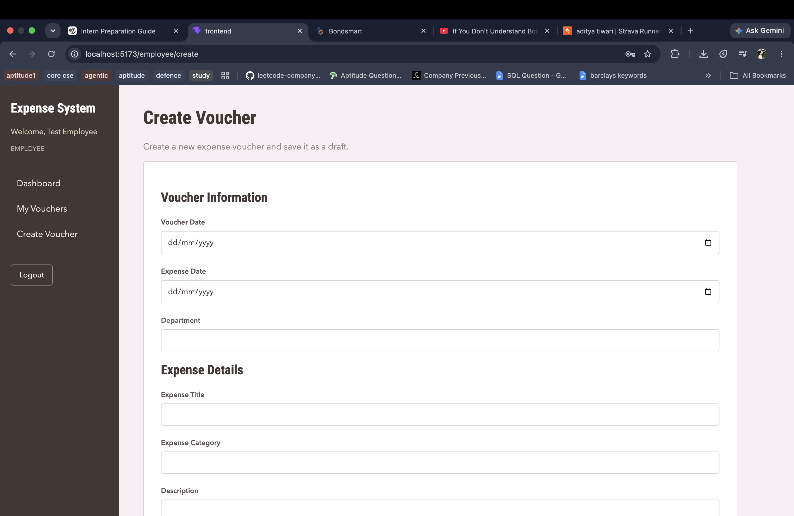
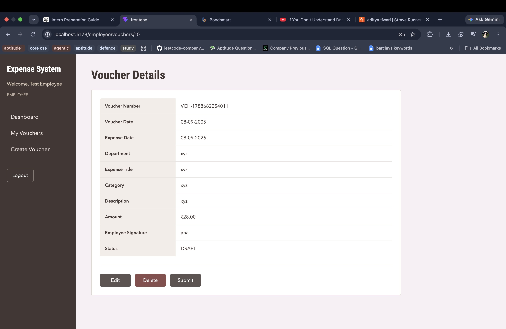
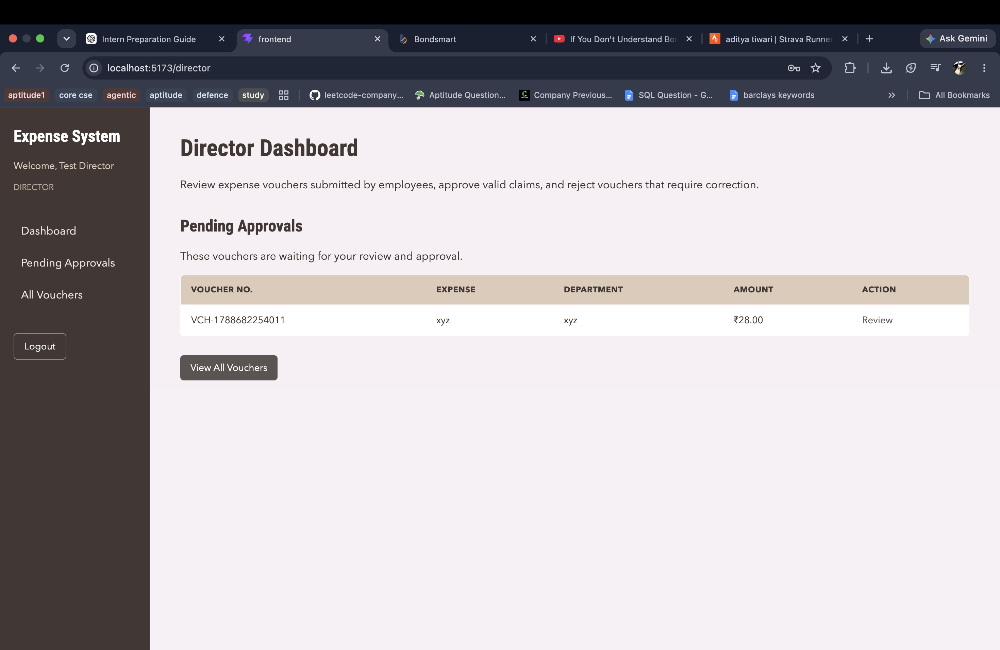
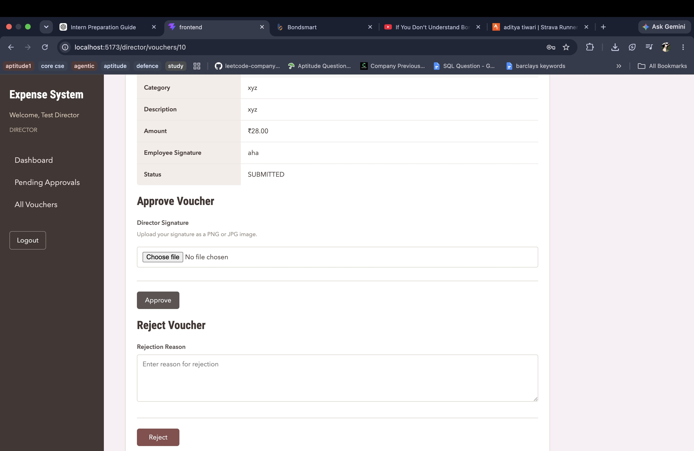
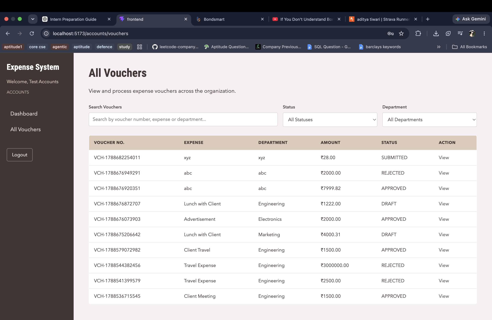
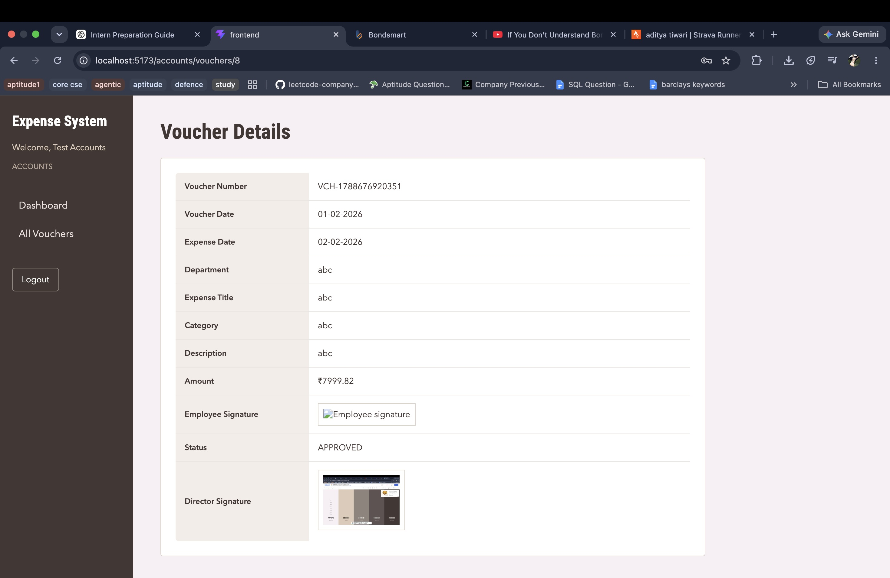

# Screenshots

This document provides screenshots of the main workflows and role-based views in the Expense Voucher Management System.

## 1. Employee Dashboard

The employee dashboard provides an overview of vouchers by status and shows recently created vouchers.

## 2. Create Voucher

Employees can create a new expense voucher and save it as a draft.

## 3. Employee Voucher Details

Employees can view their voucher details. Draft vouchers can be edited, deleted, or submitted.

## 4. Director Dashboard

The director dashboard shows vouchers pending approval and provides access to all vouchers.

## 5. Director Approval and Rejection

Directors can approve submitted vouchers by uploading a signature image or reject them with a required rejection reason.

## 6. Accounts - All Vouchers

The Accounts role can view all vouchers across the organization and filter them by search, status, and department.

## 7. Accounts - Voucher Details

Accounts users can view complete voucher details, including signatures and supporting documents where available. This view is read-only.

